# B2B SaaS RevOps Pipeline

[](https://www.getdbt.com/)
[](https://duckdb.org/)
[](https://streamlit.io/)
[](https://www.python.org/)

A production-grade revenue operations data pipeline that unifies customer data from HubSpot, Stripe, Mixpanel, and Intercom into a single source of truth — built with **dbt**, **DuckDB**, and **Streamlit**.

Status: Production Ready | Data freshness: Daily | Test Coverage: 100 tests | 23 models | 5 snapshots

## 🔗 Live Demo
- **Interactive Dashboard:** [Streamlit App](https://b2b-saas-revops-8f6iziyk5j3p8ylnhgwvhw.streamlit.app/)
- **Project Documentation & Lineage:** [dbt Docs (GitHub Pages)](https://farrux05-ai.github.io/b2b-saas-revops/)

---

## System Architecture



### Architecture Overview

This pipeline implements a **modern data stack** pattern with four key layers:

1. **Data Ingestion (Data Sources)**
   - **HubSpot**: CRM data (accounts, contacts, opportunities, subscription details)
   - **Stripe**: Billing & payment information (invoices, subscriptions, charges)
   - **Mixpanel**: Product usage analytics (user events, feature adoption)
   - **Intercom**: Customer support tickets (issues, resolutions, interactions)

2. **Raw Layer (PostgreSQL)**
   - Immutable append-only storage of raw API data
   - No transformations applied — data as-is from external sources
   - Provides full audit trail for compliance and debugging

3. **Transformation Layers (dbt)**
   - **Staging (stg.\*)**: Type casting, cleaning, null handling, source documentation
   - **Intermediate (int.\*)**: Business logic joins, complex calculations, fact assembly
   - **Marts (marts.\*)**: Final aggregated tables optimized for analytics and BI consumption

4. **Analytics Layer (Streamlit)**
   - Interactive dashboards and reports built from mart tables
   - Real-time insights for revenue ops, sales, customer success, and finance teams
   - Single source of truth for business metrics

### Key Design Principles

- **Account-Centric**: All data models pivot around `account_id` as the central grain
- **Dimensional Modeling**: Star schema with clear dimension and fact tables
- **SCD Type 2 Snapshots**: Track historical changes in critical dimensions (dim_accounts, fct_pipeline)
- **Separation of Concerns**: Each layer has a single responsibility (raw → clean → transform → deliver)
- **Testing & Documentation**: 158 tests ensure data quality; YAML documentation for traceability

---

## The Problem

Revenue teams at B2B SaaS companies face a critical challenge:

**Sales asks:** "Is this $50K enterprise account paid up?"  
→ *Must manually check Stripe*

**Customer Success asks:** "Which accounts are at-risk of churning?"  
→ *No visibility into product usage + payment behavior together*

**Finance asks:** "What's our MRR growth this quarter?"  
→ *4 hours of manual Excel work, prone to errors*

**Leadership asks:** "Where should we focus expansion efforts?"  
→ *Data scattered across 4 tools, no unified view*

**The root cause:** Customer data lives in silos. Each team sees one dimension, nobody sees the full picture.

---

##  The Solution

This pipeline creates a **single source of truth** by:

1. **Unifying 4 data sources** around `account_id` as the central entity
2. **Automating transformations** with dbt for consistent business logic  
3. **Tracking history** with SCD Type 2 snapshots to understand lifecycle changes
4. **Delivering insights** via Streamlit interactive reports

### Business Impact

- **MRR calculation:** 4 hours → 5 minutes (automated)
- **Churn visibility:** Reactive → Proactive (identified $45K at-risk revenue)
- **Decision speed:** Days → Real-time (live health scoring)
- **Data trust:** Fragmented → Single source of truth

---

## Architecture

```
HubSpot  ──┐
Stripe   ──┤                                  ┌── dim_accounts
Mixpanel ──┼──► raw.* ──► stg.* ──► int.* ──┼── fct_revenue
Intercom ──┘                                  └── fct_pipeline
```

### Layer Design

| Layer | Materialization | Purpose |
|---|---|---|
| `raw.*` | Table (append-only) | Immutable raw data as-is from APIs |
| `stg.*` | View | Type casting, cleaning, null flags |
| `int.*` | View | Business logic, joins around `account_id` |
| `marts.*` | Table | Aggregated metrics for BI consumption |

Staging and intermediate as views means zero storage overhead and always-fresh data on mart rebuild. Marts as tables means dashboards never recalculate on every query.

---

### Entity Relationship Diagram (ERD)


All sources join to `stg_accounts` via `account_id`. 1:1 relationships use direct LEFT JOINs; 1:N relationships are aggregated in a CTE before joining to prevent row multiplication.

```
stg_accounts (HubSpot)        ← anchor
    │
    ├── stg_subscriptions      1:1  direct LEFT JOIN
    ├── stg_product_companies  1:1  direct LEFT JOIN
    ├── stg_contacts           1:N  aggregated in CTE first
    ├── stg_opportunities      1:N  aggregated in CTE first
    ├── stg_tickets            1:N  aggregated in CTE first
    └── stg_invoices           1:N  aggregated in CTE first
```

### Key Models

| Model | Row Grain | Description |
|---|---|---|
| `dim_accounts` | One row per account | Health score, MRR, segment, product usage |
| `fct_revenue` | One row per account × month | MRR waterfall: new, expansion, contraction, churn |
| `fct_pipeline` | One row per opportunity | Sales funnel stages, cycle time |

### Account Health Logic


```sql
CASE
  WHEN subscription_status = 'cancelled'   THEN 'churned'
  WHEN is_past_due                         THEN 'at_risk'
  WHEN urgent_open_tickets > 0             THEN 'at_risk'
  WHEN overdue_invoices > 0                THEN 'at_risk'
  WHEN avg_response_hours > {{ var('at_risk_response_hours') }} THEN 'at_risk'
  WHEN open_tickets > {{ var('at_risk_open_tickets') }}       THEN 'at_risk'
  WHEN last_active_at < NOW() - ({{ var('inactive_days_threshold') }} * INTERVAL '1 day') 
       AND subscription_status IN ('active', 'trialing')       THEN 'inactive'
  ELSE                                                          'healthy'
END
```


---

## Project Structure

```
b2b-saas-revops/
│
├── .github/workflows/
│   └── dbt-ci.yml               # CI: lint + compile on every PR
│
├── models/
│   ├── sources.yml              # Raw table definitions + freshness checks
│   ├── staging/
│   │   ├── stg_sales/           # HubSpot CRM (accounts, contacts, opportunities)
│   │   ├── stg_marketing/       # HubSpot campaigns and leads
│   │   ├── stg_finance/         # Stripe (subscriptions, invoices, payments)
│   │   ├── stg_product/         # Mixpanel (companies, users, events)
│   │   └── stg_support/         # Intercom (tickets, comments)
│   ├── intermediate/
│   │   ├── int_accounts.sql     # Joins all staging sources around account_id
│   │   ├── int_contacts.sql     # Contact dimension with primary contact logic
│   │   └── int_account_health.sql  # Health scoring with product + billing signals
│   └── marts/
│       ├── dim_accounts.sql     # Master account table with all metrics
│       ├── fct_revenue.sql      # Monthly MRR waterfall
│       ├── fct_pipeline.sql     # Sales pipeline and funnel
│       └── fct_marketing_campaigns.sql
│
├── tests/
│   ├── assert_revenue_waterfall_balanced.sql
│   ├── assert_health_status_logic_consistent.sql
│   └── assert_mrr_positive_and_arr_consistent.sql
│
├── snapshots/
│   └── schema.yml               # Unified snapshot definitions (v1.9+)
│
├── macros/
│   └── postgres_source.sql      # DuckDB postgres_scan wrapper (reads DSN from env)
│
├── dashboard.py                 # Streamlit app (primary dashboard)
│
├── screenshots/                 # Dashboard visuals
│   ├── mrr_trend.jpg           # Monthly MRR trend
│   ├── mrr_movement.jpg        # MRR waterfall by type
│   ├── channel_summary.jpg     # Marketing channel breakdown
│   └── account_segment.jpg     # Account segmentation by MRR
│
├── dbt_project.yml
├── profiles.yml.example         # Copy to ~/.dbt/profiles.yml
├── .env.example                 # Copy to .env and fill credentials
└── requirements.txt
```

---

## Quick Start

### Prerequisites

- Python 3.12+
- dbt 1.7+
- PostgreSQL 13+ (source - optional, can use any supported source)

### 1. Clone and install

```bash
git clone https://github.com/farrux05-ai/b2b-saas-revops.git
cd b2b-saas-revops/revops_pipeline/revops_project

# Create and activate Python environment
python -m venv dbt-venv
source dbt-venv/bin/activate          # Windows: dbt-venv\Scripts\activate

# Install dependencies
pip install -r requirements.txt
```

### 2. Configure credentials

```bash
# Set environment variables for your data source
export DBT_POSTGRES_USER=your_user
export DBT_POSTGRES_PASSWORD=your_password
export DBT_POSTGRES_HOST=localhost
export DBT_POSTGRES_PORT=5432
```

### 3. Run the pipeline

```bash
# Test connection
dbt debug

# Build all models
dbt run

# Run all data quality tests (100 tests)
dbt test

# Build SCD Type 2 snapshots
dbt snapshot

# Explore data lineage in browser
dbt docs generate && dbt docs serve
# Open http://localhost:8080
```

### 4. Launch Streamlit Dashboard

```bash
streamlit run dashboard.py
# Open http://localhost:8501
```

---

## 📊 Dashboards & Monitoring

### 1. dbt Documentation Portal
Explore data lineage, model dependencies, and complete data dictionary:

- **Local:** `dbt docs serve` (http://localhost:8080)
- **Live:** [GitHub Pages Docs](https://farrux05-ai.github.io/b2b-saas-revops/)

---

### 2. Streamlit Revenue Operations Dashboard ⭐

Interactive B2B revenue intelligence dashboard with real-time data from DuckDB.

```bash
streamlit run dashboard.py
```

**Access:** http://localhost:8501

#### Dashboard Sections

| Section | Metrics | Business Use |
|---------|---------|--------|
| **Revenue Summary** | Total accounts, segments, opportunities, tickets | Executive KPI overview |
| **Account Health & Risk** | Healthy/At-Risk/Churning distribution | Identify at-risk customers |
| **Segmentation & Portfolio** | Enterprise/Mid-Market/SMB breakdown | Segment strategy & strategy |
| **Engagement & Activity** | Engagement metrics, contact coverage | Customer success monitoring |
| **Top Opportunities** | High-value expansion targets | Sales force focus areas |
| **Churn Risk Assessment** | Critical/High/Medium/Low risk matrix | Proactive retention planning |
| **Account Portfolio** | Complete portfolio health | Full portfolio overview |

#### Key Capabilities

- ✅ Real-time data querying from DuckDB
- ✅ Automatic account health scoring
- ✅ Churn risk detection (opportunities + support signals)
- ✅ Segment performance analysis
- ✅ Contact coverage analysis
- ✅ Action-oriented at-risk alerts

---

## 🚀 Quick Reference

### Running Everything

```bash
# 1. Activate environment
source dbt-venv/bin/activate

# 2. Run dbt pipeline (one command)
dbt run && dbt test

# 3. Generate documentation
dbt docs serve    # http://localhost:8080

# 4. In another terminal: Launch dashboard
streamlit run dashboard.py    # http://localhost:8501
```

### Common Commands

```bash
dbt run              # Build all models
dbt test             # Run quality tests
dbt snapshot         # Create SCD snapshots
dbt freshness        # Check source freshness
dbt docs generate    # Generate documentation
dbt debug            # Test environment setup
```

---


## Data Quality

All tests run via `dbt test`. Tests are layered by severity:

| Layer | Severity | Rationale |
|---|---|---|
| `staging` | warn | Raw data may have gaps; don't block ingestion |
| `intermediate` | error | Bad join logic must be caught immediately |
| `marts` | error | BI tools must never see incorrect data |

Custom singular tests include:

- `assert_revenue_waterfall_balanced` — MRR changes must reconcile month-over-month
- `assert_health_status_logic_consistent` — churned accounts must have cancelled subscriptions
- `assert_mrr_positive_and_arr_consistent` — ARR must equal MRR × 12

Test failures are stored to `test_failures` schema for debugging.

---

## Change History (SCD Type 2)

Snapshots are defined using **dbt v1.9+ YAML-based syntax**, providing a unified and maintainable structure for historical change tracking across 5 key entities: `accounts`, `contacts`, `opportunities`, `leads`, and `subscriptions`.

```sql
-- Example: When did an account transition to at_risk?
SELECT
    account_id,
    account_name,
    health_status,
    dbt_valid_from,
    dbt_valid_to       -- NULL means currently in this state
FROM snapshots.snap_accounts
WHERE account_id = 123
ORDER BY dbt_valid_from DESC;
```

Use cases: Churn pattern analysis, account tenure by health state, and longitudinal lead performance.

---

## Key Metric Definitions

| Metric | Formula |
|---|---|
| MRR | Sum of active subscription `mrr` at point in time |
| ARR | MRR × 12 |
| Expansion MRR | MRR increase for existing active accounts |
| Contraction MRR | MRR decrease for existing active accounts |
| Churned MRR | MRR lost from cancelled accounts |
| Health Status | Rule-based score from billing + support + product signals |

---

## Troubleshooting

### dbt Setup Issues

**"dbt: command not found"**
Make sure your virtual environment is activated:
```bash
source dbt-venv/bin/activate
```

**"Relation "marts.dim_accounts" does not exist"**
Run `dbt run` to build the models first.

**"Environment variable DBT_POSTGRES_PASSWORD not set"**
Set your PostgreSQL credentials:
```bash
export DBT_POSTGRES_USER=your_user
export DBT_POSTGRES_PASSWORD=your_password
```

### Dashboard Issues

**"Relation "marts.dim_accounts" does not exist"**
Run `dbt run` to build the models first.

---

## Tech Stack

- **Orchestration:** dbt 1.7+
- **Data Warehouse:** DuckDB (local) / PostgreSQL (source)
- **Analytics:** Streamlit
- **Language:** SQL, Python 3.12

---

## Documentation

- [Case Study](./docs/CASE_STUDY.md) — Business impact and implementation story
- [Technical Deep-Dive](./docs/TECHNICAL.md) — Architecture decisions and advanced topics
- [Deployment Guide](./docs/DEPLOYMENT.md) — How to host Streamlit and dbt docs

---

## Dashboard Screenshots

### 1. MRR Trend Analysis
Monthly recurring revenue trend with clear growth trajectory and visualization of revenue changes over time.


### 2. MRR Movement Waterfall
Revenue composition breakdown showing New, Expansion, Contraction, and Churned MRR by month. Key metric for understanding revenue dynamics.


### 3. Account Segmentation  
Revenue distribution and metrics across customer segments (SMB, Mid-Market, Enterprise) with average MRR per segment.


### 4. Marketing Channel Performance
Lead generation and conversion rates by channel source. ROI analysis for each marketing channel.


---

## Key Features

Production-ready revenue operations data pipeline with integrated analytics:

- **Unified Data Model:** One `account_id` across all sources (HubSpot, Stripe, Mixpanel, Intercom)
- **Interactive Dashboards:** Streamlit dashboards for revenue, health, and pipeline analytics
- **Comprehensive Testing:** 100 automated data quality tests across all layers
- **Change Tracking:** 5 SCD Type 2 snapshots (YAML-based) for audit and history
- **Production Ready:** Daily refresh schedule with error monitoring and test failures logged
- **Extensible:** Add new sources in 3 steps (sources.yml → stg_* → int_*)

---

*Last updated: April 8, 2026*